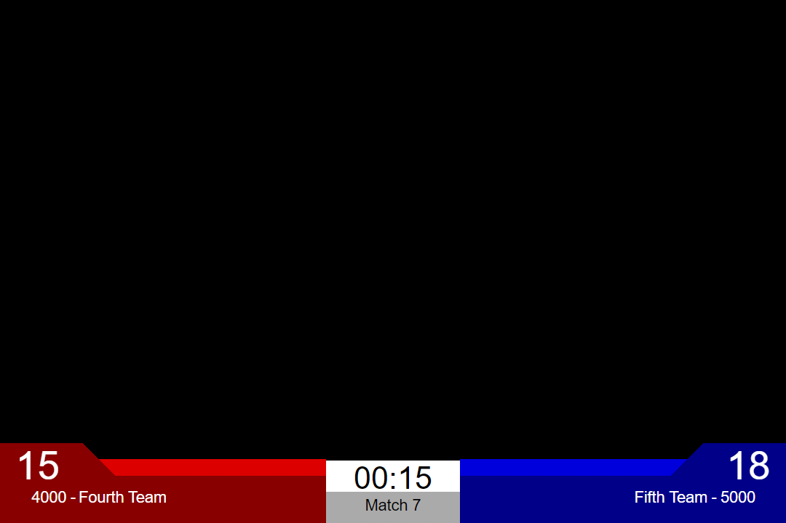
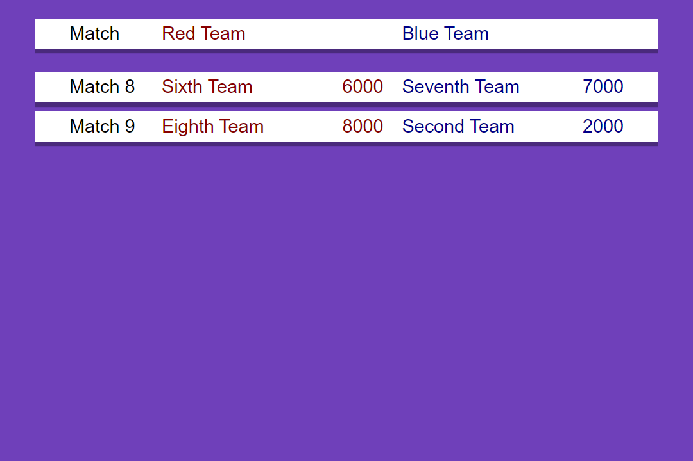
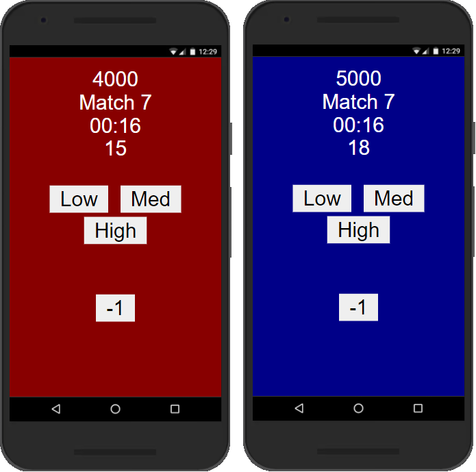
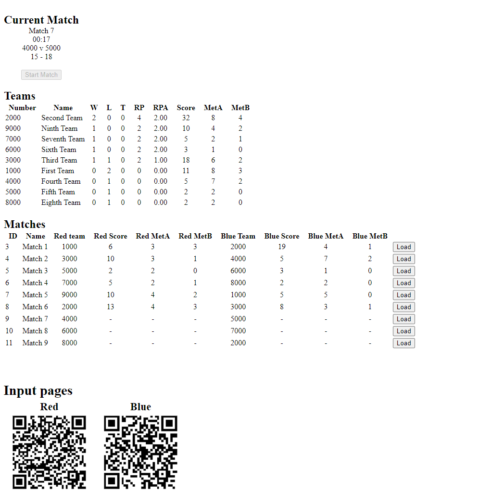

# Greg's Tournament Management System
Greg's Tournament Management System is a centralized scheduling and scoring system for simple tournaments, based on by FIRST Robotics Competition's Field Management System.

## Features
 - Live scoring from any number of input devices
 - Track and display ranking across multiple matches
 - Track and display cumulative values for score and 2 custom metrics
 - Display schedule of upcoming matches
 - Highly configurable to meet various user needs
 - System operations can be distributed across multiple devices
 - Designed for camera passthrough with OBS

## Views
### Game View (`/game`)
The game view is the primary way displaying scores during gameplay. It is designed to have the background replaced with a camera feed in OBS.


### Postgame View (`/postgame`)
The postgame view shows the outcome of a match. It shows match result, score, teams, and change in ranking. Additional statistics can be set in config.


### Alternate Game View (`/altgame`)
The alterate game view is a fullscreen view dervied from the postgame view. This shows more complete match statistics, but does not have support for camera passthrough.


### Scoreboard View (`/scoreboard`)
The scoreboard view displays the cumulative scores from all played matches. The displayed columns can be configured to meet application requirements.


### Schedule View (`/schedule`)
The schedule view displays the list of upcoming matches. The displayed columns can be configured to meet the application.




## Pages

### Homepage (`/`)
The homepage allows for easily selecting a single view. The user can hover over the top-left to see a list of buttons to change the visible page.
### Automatic Page (`/autopage`)
The automatic page is designed to be the primary audience view. The page will automatically cycle between views as events occur. To select a page manually when opening, buttons will appear in the top-right on hover. This page can create high server traffic as it maintains open connections for all pages.

The page will cycle views on the following events:
 - **Show Game Button** -> Game View
 - **Match Started** -> Game View
 - **Match Saved** -> Postgame View (1 min) -> Scoreboard
 - **Scoreboard Page Duration** -> Schedule
 - **Schedule Page Duration** -> Scoreboard

The scoreboard page duration is the time required to show all pages from config. The schedule page duration is the time required to show 2 scoreboard pages.

### Input Page (`/input?a=[red|blue]&auth=[authString]`)
The input page is designed for mobile devices to provide data for live scoring. Team colour should be specified in the Query String, otherwise inputs will not be registered. Additionally, the `authString` must be provided for secruity. Any number of devices can be used in this role, but there is no system to detect duplicate inputs.




### Control Page (`/control?auth=[authString]`)
The control page is the central point for operating the system. The `authString` must be provided as a query argument for secruity. From this page, the user can start a match, save the scores, and load the next or any match. It also includes information about the current match, a scoreboard, and the complete match schedule with scores. QR codes are provided for the input page, which include colour and authString parameters.




### Audio Page (`/audio`)
The audio page is used to get sound effects from the server. To prevent requests from devices where audio is not desired, only the automatic page contains bundled audio. For other uses, this must be opened in a separate tab. Sound effects must be provided by the user, and will play at points in the match specified in config.

## Tracked Data
A wide variety of statitics about team performance are saved and calculated. These statis include team info, win/loss/tie stats, total score across matches, and sums for 2 user-defined metrics. The following information is provdided for each team at the `/teams/scoreboard` endpoint.
- **number:** Team number
- **name:** Team name
- **wins:** Number of wins
- **losses:** Number of losses
- **ties:** Number of ties
- **numMatches:** Number of matches the team has played, calculated as `wins+losses+ties`
- **score:** Sum of match scores
- **scoreAvg:** Average match score, calculated as `score/(numMatches)`
- **metA:** Sum of metA
- **metB:** Sum of metB
- **rp:** Ranking Points, calculated by a [user-supplied function](#rankPointFunction)
- **rpa:** Ranking Point Average, calculated as `rp/(numMatches)`

## Configuration
There are various elements of the system which can be configured to meet user requirements. Configuration settings are placed in `config.js`.
### Server Settings
 - **port:** The port used by the webserver
 - **authString:** The string required to make changes
 - **initScript:** The sql script to be run on initialization, this should clear any existing data and insert values for teams and match schedule. Refer to [Initializing Database](#initialising-database) for details.
 - **matchLength:** The length of a match, in seconds
 - **freezeDelay:** Delay before game views freeze, in seconds. After this time has passed score changes will cause "Match Under Review" banner to appear instead of displayed score changing. This is intended to allow for fixing input mistakes without the displayed score fluctuating. 

### Audio Settings
The audio played by the system can be configured to play user-defined files at any point in the match. Configuration has the following properties:
 - **leadTime:** Time in seconds to start audio prematurely, used to combat network latency
 - **interrupted:** Path to audio file which should be played when a match in interrupted (another is loaded before ending)
 - **sequence:** Sequence of audio files to be played during the match
#### Sequence
Sequence is a list of audio files and timestamps. The server will instruct the aduio page to load the files at specified timestamps. Each entry has two properties:
 - **time:** Time to start audio, match time remaining in seconds
 - **source:** Path to audio file
### Scoreboard
The scoreboard can be configured to display any combination of statistics across a number of pages. Configuration has the following properties:
 - **duration:** The duration each page is displayed before cycling, in seconds
 - **rankCol:** Configuration for the column always displayed next to team info, should be clear indication of ranking. Defaults to Ranking Point Average (RPA)
 - **data:** Configuration options for what data is displayed
#### Data
Data is a list of pages, each being a list of displayed columns. While the Rank, Team, and rankCol columns are always shown, the remaining space is free for any user-defined columns. Each column has three properies:
 - **name:** Name to be displayed in header
 - **width:** Width of column, in em. This will need some tweaking to find sizes that work for target display
 - **func:** Callback function used to get the column's value. Takes [team score data](#tracked-data) as input, and returns a string as output

 The default scoreboard layout used to generate the screenshots is shown below. While the functions in this example just return an item from the data, more complex operations can be used.

 ```js
[
  [
    {
      name: "Wins",
      width: 3,
      func: (t) => t.wins
    },
    {
      name: "Losses",
      width: 3,
      func: (t) => t.losses
    },
    {
      name: "Ties",
      width: 3,
      func: (t) => t.ties
    }
  ],
  [
    {
      name: "Score",
      width: 4,
      func: (t) => t.score
    },
    {
      name: "MetA",
      width: 3,
      func: (t) => t.metA
    },
    {
      name: "MetB",
      width: 3,
      func: (t) => t.metB
    }
  ]
]
 ```

### Postgame
The postgame view can be conifgured to behave in various ways. Configuration has the following properties:
 - **duration:** Duration autoview shows postgame view after a match, in seconds.
 - **breakdown:** Values to show in match breakdown

#### Breakdown
The match breakdown display on the post game view can be customized by providing a list of JSON objects similar to a sccoreboard view. Each object consits of a name to be displayed and function to be used for obtaining the value. The functions are provided with a team's match performance, which has the following properties:
 - **num:** The team's number
 - **name:** The team's name
 - **score:** The team's score
 - **metA:** The team's Metric A performance
 - **metB:** The team's Metric B performance

### Input Buttons
The buttons on the input page can be customized by providing a list of JSON objects. Singular buttons added to the list will be vertically spaced, if a list of buttons is added they will be grouped vertically and spaced horizontally.

Each button has the following properties, only text is required:
 - **text:** The button's text
 - **score:** The change to be made to score
 - **metA:** The change to be made to metA
 - **metB:** The change to be made to metB
 - **spaceBefore:** Space to be placed before button, in `em`
 - **spaceAfter:** Space to be placed after button, in `em`

### Ranking Calculation
The two functions used for ranking teams is provided by the configuration file. `rankPointFunction(t)` takes [team score data](#tracked-data) for a team and returns their Ranking Points, `sortFunction(a, b)` takes data for 2 teams and returns sorting instructions.
#### rankPointFunction
The rankPointFunction should return the number of ranking points earned by the team from their current stats. The number it returns will be averaged across the number of matches to obtain the Ranking Point Average. The default function shown below gives 2 RP for a win, and 1 for a tie.

```js
(t) => {
  return 2*t.wins + 1*t.ties;
}
```
#### sortFunction
The sortFunction should should -1 if `b` is ranked higher than `a`, and 1 if `a` is ranked higher than `b`. Any combination of the above data can be used in calculating the ranking order. The default sorting function shown below sorts by RPA, then average score, then MetA.

```js
(a, b) => {
  // Sort by ranking point average, in event of tie sort by average score then metA
  let delta = b.rpa - a.rpa;
  if(delta == 0)
    delta = b.scoreAvg - a.scoreAvg;
  if(delta == 0)
    delta = b.metA - a.metA;
  return delta;
}
```
## Initialising Database
When the application is first run, it will automatically create the database file, `db.sqlite`, and run a specified `initScript` to setup the tables for operation. This code should clear any existing data, insert teams, and insert the match schedule. The following code is the example used for creating the screenshots, and can be found in `setup.sql`: 

```SQL
DELETE FROM scores WHERE 1=1;
DELETE FROM schedule WHERE 1=1;
DELETE FROM teams WHERE 1=1;


INSERT INTO teams (number, name) VALUES
    (1000, "First Team"),
    (2000, "Second Team"),
    (3000, "Third Team"),
    (4000, "Fourth Team"),
    (5000, "Fifth Team"),
    (6000, "Sixth Team"),
    (7000, "Seventh Team"),
    (8000, "Eighth Team"),
    (9000, "Ninth Team");

INSERT INTO schedule (type, number, redTeam, blueTeam) VALUES
    ("Match", 1, 1000, 2000),
    ("Match", 2, 3000, 4000),
    ("Match", 3, 5000, 6000),
    ("Match", 4, 7000, 8000),
    ("Match", 5, 9000, 1000),
    ("Match", 6, 2000, 3000),
    ("Match", 7, 4000, 5000),
    ("Match", 8, 6000, 7000),
    ("Match", 9, 8000, 2000);

SELECT * FROM teams;
SELECT * FROM schedule;
```