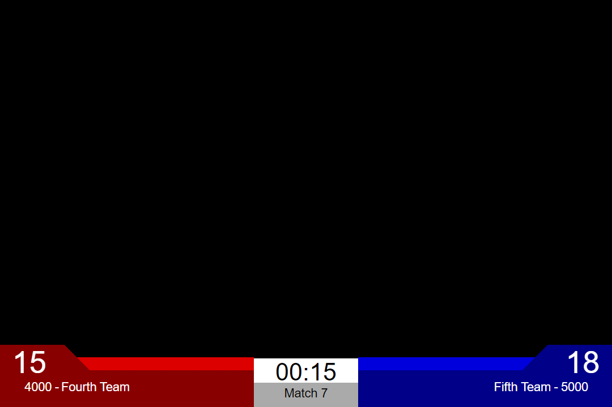
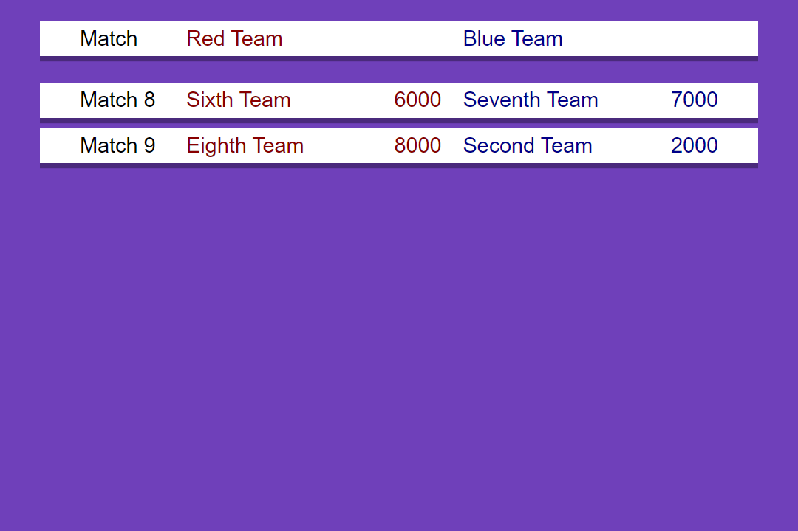
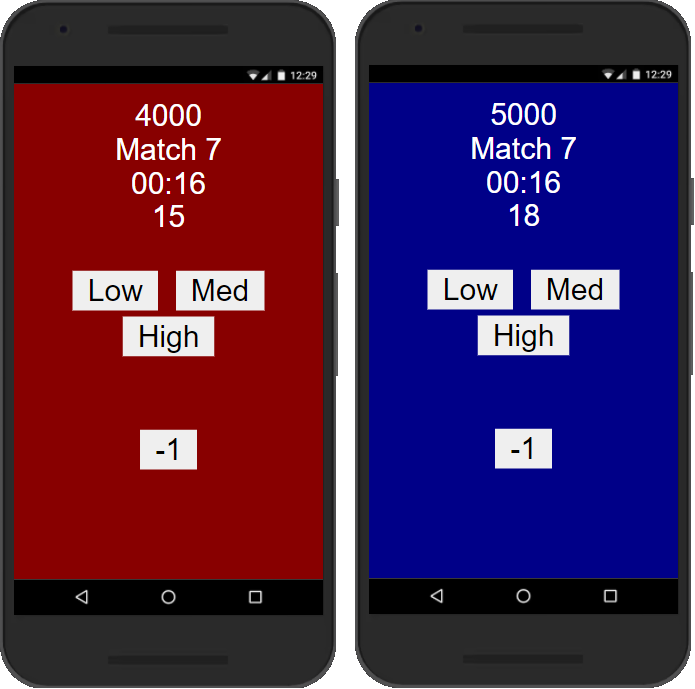
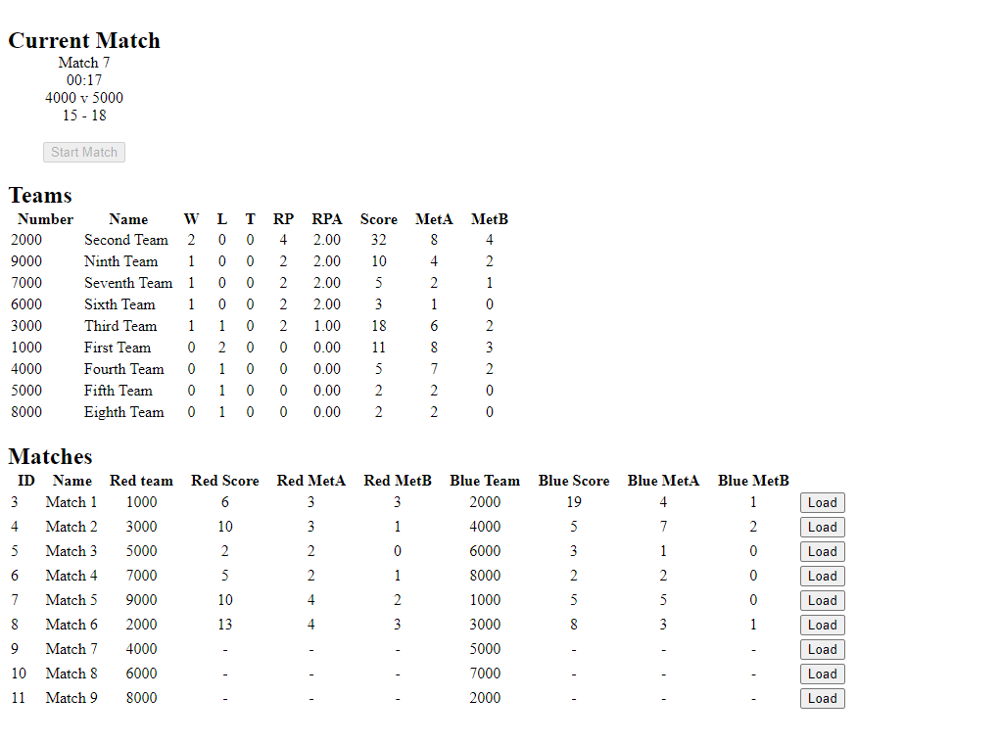

# Greg's Tournament Management System
Greg's Tournament Management System is a centralized scheduling and scoring system for simple tournaments, based on by FIRST Robotics Competition's Field Management System.

## Features
 - Live scoring from any number of input devices
 - Designed for camera passthrough with OBS
 - Track and display ranking across multiple matches
 - Track and display cumulative values for score and 2 custom metrics
 - Display schedule of upcoming matches
 - Central control and display can be on separate devices

## Pages
### Game Page (`/game`)
The game page is the primary way displaying scores during gameplay. It is designed to have the background replaced with a camera feed in OBS.


### Scoreboard Page (`/scoreboard`)
The scoreboard page displays the cumulative scores from all played matches. It contains the following columns:
 - **Rank:** The team's current rank, calculated based on RPA
 - **RPA:** Ranking point average, calculated as `AVG(Wins*2 + Ties)`
 - **Wins:** Number of games won
 - **Losses:** Number of games lost
 - **Ties:** Number of games tied
 - **Score:** Cumulative score from matches
 - **MetA:** Cumulative value of custom metric A, heading should be changed to match application
 - **MetB:** Cumulative value of custom metric B, heading should be changed to match application


### Schedule Page (`/schedule`)
The schedule page displays the list of upcoming matches.




### Input Page (`/input?a=[red|blue]`)
The input page is designed for mobile devices to provide data for live scoring. Team colour should be specified in the Query String, otherwise inputs will not be registered. Any number of devices can be used in this role so long as users do not submit duplicate inputs.

These pages should be customised to match the use case requirements.



### Control Page (`/control`)
The control page is the central point for operating the system. From this page, the user can start a match, save the scores, and load the next or any match. It also includes information about the current match, a scoreboard, and the complete match schedule with scores.




## Setup
### Configuring System
There are various elements of the system which should be configured to meet user requirements.
#### Input buttons
The buttons in the input page can be replaced with ones which are more useful for scorers. Buttons should call `addScore(delta, dA=0, dB=0)`, with their change in score and optionally changes in MetricA and MetricB
#### Ranking calculation
Ranking is done by the sorting callback at the end of `getScoreboard()` in `manager.js`. This function should be modified to meet user's ranking requirements.
#### Scoreboard
The scoreboard page should be configured to show relevant names for MetricA and MetricB instead of the default placeholders. Additionally, one or both columns can be removed if not needed. Note that changes to number of columns will required updates in the stylesheet.

### Initializing Database
When the application is first run, it will automatically create the database file, `db.sqlite`. Once the file has been created, the team list and match schedule must be manually loaded using [sqlite](https://www.sqlite.org/index.html). The easiest method is by loading the commands in from a file using the `.read` command, with a file such as the following:

```SQL
DELETE FROM scores WHERE 1=1;
DELETE FROM schedule WHERE 1=1;
DELETE FROM teams WHERE 1=1;


INSERT INTO teams (number, name) VALUES
	(1000, "First Team"),
	(2000, "Second Team"),
	(3000, "Third Team"),
	(4000, "Fourth Team"),
	(5000, "Fifth Team"),
	(6000, "Sixth Team"),
	(7000, "Seventh Team"),
	(8000, "Eighth Team"),
	(9000, "Ninth Team");

INSERT INTO schedule (type, number, redTeam, blueTeam) VALUES
	("Match", 1, 1000, 2000),
	("Match", 2, 3000, 4000),
	("Match", 3, 5000, 6000),
	("Match", 4, 7000, 8000),
	("Match", 5, 9000, 1000),
	("Match", 6, 2000, 3000),
	("Match", 7, 4000, 5000),
	("Match", 8, 6000, 7000),
	("Match", 9, 8000, 2000);

SELECT * FROM teams;
SELECT * FROM schedule;
```